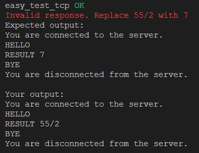

# Client-for-Calculator-Protocol
## IPK Project 1: IPK Calculator Protocol
### VUT University : IPK_2023 Project1

## Table of contents
- Task
- Project description
- Usage
    - Compile
    - Run
    - Help
    - Use
- Technical details
- How it works
- Features
- Tests
- Licence
- Used sources

## Task
Implement a client for the IPK Calculator Protocol.

## Project description 
The client program connect to the server which use [IPKCP](https://git.fit.vutbr.cz/NESFIT/IPK-Projekty/src/branch/master/Project%201/Protocol.md) (It is a client-server protocol that allows a client to send mathematical expressions to a server, and receive the result of the calculation), send requests (which was given by user in standart input) to the server and receive responses in return.

## Usage
### Compile
This project can be compiled using Makefile:
```
make
```
### Run
After compilation it can be run using following command:
```
./ipkcpc -h <host> -p <port> -m <mode>
```
Where:  
`host` - is the IPv4 address of the server  
`port` - the server port  
`mode` - either `tcp` or `udp`  

### Help
For help write:
```
./ipkcpc --help
```
### Use

"TCP" - If your mode is `tcp`, when you connect to the server, you will receive: `"You are connected to the server."` Then you can type your message according to [IPKCP](https://git.fit.vutbr.cz/NESFIT/IPK-Projekty/src/branch/master/Project%201/Protocol.md) into standart output. It will be sent to server. After that you will receive respond to it.  
In case of error you will receive `"BYE"` and connection with server will be closed, you will receive:
`"You are disconnected from the server."`
And program ends.  
If you want to end up with program you should type `"BYE"` or press keyboard shortcut `Ctrl+C`. You will be disconnected, and program ends. 

"UDP" - If your mode is `udp`, you can type your message according to [IPKCP](https://git.fit.vutbr.cz/NESFIT/IPK-Projekty/src/branch/master/Project%201/Protocol.md) into standart output right after running the program. It will be sent to server. After that you will receive respond to it.  
In case of error you will receive `"ERR:"` and message of error.  
In server does not respond after 5 sec, you will receive `"Timeout"` and connection with server will be closed and program ends.  
If you want to end up with program you should press keyboard shortcut `Ctrl+C`. You will be disconnected, and program ends.  

## Technical details
Program was written in C language.  
Program can works as client only on Linux based systems.

## How it works
The client program implement the following steps:

1. Establish a TCP/UDP connection to the server.        
2. Send a message to the server containing the mathematical expression to be calculated, using the message format  [IPKCP](https://git.fit.vutbr.cz/NESFIT/IPK-Projekty/src/branch/master/Project%201/Protocol.md).  
3. Wait for the server to send a response containing the result of the calculation.  
4. Parse the response and output the result to the user.  
5. Close the connection to the server. 

## Features
Implementing a client looked like:  
- Parsing command-line arguments and setting them into server addres structure.  
- Implement the client-side socket.  
- Make TCP connection with the server.
- Implement the message exchange: Once the client has established a connection, it can start exchanging messages with the server. The client send a command message to the server and wait for the server's response (for UDP it also need to encode user's message and decode server's responce).
- If error occured, program prints error message on standart error output, close socket and end program.
- In order for the user to be able to finish the program on his own, he need ro press `"Ctrl+C"`. Therefore, program also handles this keyboard shortcut and ending the program correctly.

## Tests
Tests were written in python. They check basic functionality of the program. 
Tester connects to the server, send input and receive expected output which compare with output from client program.  
Tester also can check for timeout. For it exist additional argument in functions.  
Here is screenshot for `tcp` mode:  


Here is screenshot for `udp` mode:  


Fixed error:


To run tests use following command:  
```
python3 ./test.py -h <host> -p <port> -m <mode>
```

## License
The program was made according to GNU General Public Licence v3.0.

## Used sources
*Coding standart for C* https://users.ece.cmu.edu/~eno/coding/CCodingStandard.html#cuh  
*Basics of TCP Server-Client implementation in C* https://www.geeksforgeeks.org/tcp-server-client-implementation-in-c/  
*Overview of socket programming from IBM* https://www.ibm.com/docs/en/i/7.1?topic=communications-socket-programming  
~ *Most needed from IBM: Signals for blocking socket APIs* https://www.ibm.com/docs/en/i/7.1?topic=designs-example-using-signals-blocking-socket-apis
